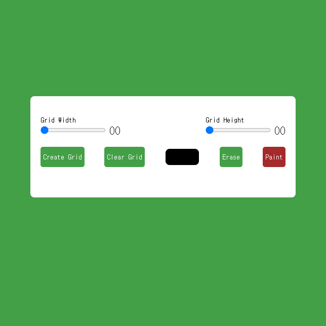

## Pixel Art Generator

### Screenshot

### Points

터치 기기와 비터치 기기(예: 마우스 사용)를 모두 지원하는 그리드 기반의 드로잉 애플리케이션. 사용자는 그리드 위에서 클릭(또는 터치)하여 색을 채울 수 있으며, 드래그하여 여러 그리드 셀에 걸쳐 색을 채울 수도 있음.

#### `isTouchDevice` 함수

- 이 함수는 현재 기기가 터치 기능을 지원하는지 확인.
- `document.createEvent('TouchEvent')`를 사용하여 'TouchEvent' 이벤트를 생성 시도.
- 이 시도가 성공하면, 현재 기기를 터치 기기(`deviceType = 'touch'`)로 간주하고 `true`를 반환.
- 시도가 실패하면(예외 발생), 현재 기기를 비터치 기기(`deviceType = 'mouse'`)로 간주하고 `false`를 반환.
