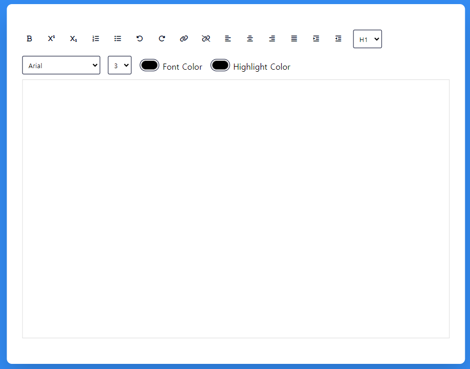

## Rich Text Editor

### Screenshot



### 참조 사이트

- [font-awesome_cdnjs](https://cdnjs.com/libraries/font-awesome)
- [font-awesome](https://fontawesome.com/)
- [google font](https://fonts.google.com/)

### Points

#### execCommand

- [Document.execCommand()](https://developer.mozilla.org/ko/docs/Web/API/Document/execCommand)

`document.execCommand`는 웹 페이지에서 리치 텍스트 편집 기능을 구현할 때 사용되는 JavaScript API. 이 명령을 사용하면 사용자가 웹 페이지 내의 편집 가능한 영역에서 텍스트를 볼드체로 만들거나, 이탤릭체를 적용하거나, 하이퍼링크를 추가하는 등의 텍스트 편집 작업을 수행할 수 있음.

```javascript
document.execCommand(commandName, showDefaultUI, valueArgument);
```

- `commandName`: 실행할 명령의 이름을 문자열로 지정. 예를 들어, 'bold'는 선택된 텍스트를 볼드체로 만들고, 'createLink'는 하이퍼링크를 생성.
- `showDefaultUI`: 대부분의 브라우저에서 이 매개변수는 무시되며, 보통 `false`로 설정.
- `valueArgument`: 명령에 추가적인 값을 제공해야 할 경우 사용. 예를 들어, 'createLink' 명령에는 URL을 문자열로 제공해야 함.

##### 예시

볼드체로 텍스트를 변경 :

```javascript
document.execCommand('bold');
```

하이퍼링크를 추가하는 예 :

```javascript
document.execCommand('createLink', false, 'https://example.com');
```

##### 주의사항

`document.execCommand`는 오래되었고 더 이상 사용되지 않는 기능으로, 그 대안으로는 현대적인 API인 [ContentEditable](https://developer.mozilla.org/en-US/docs/Web/Guide/HTML/Editable_content)를 참조하는 것이 좋음.
