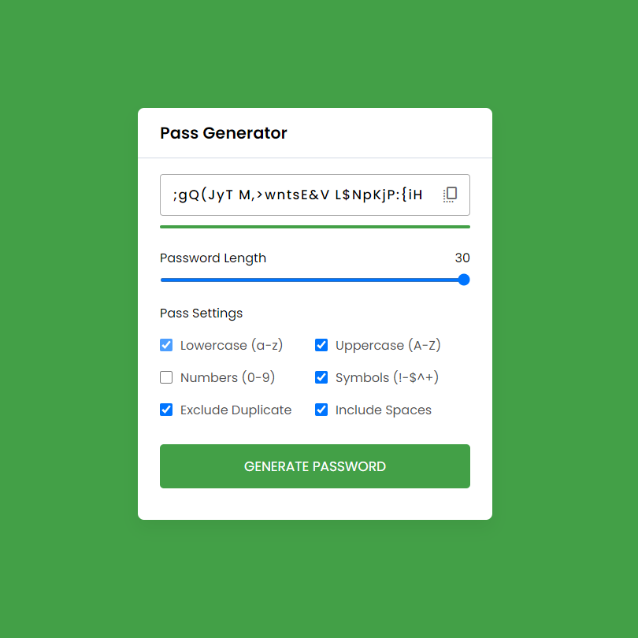

## Password Generator

### Screenshot

### 참조 사이트

- [google font - icons](https://fonts.google.com/icons)

### Points

사용자가 정의할 수 있는 옵션을 기반으로 비밀번호를 생성하고, 생성된 비밀번호를 화면에 표시하며, 사용자가 비밀번호를 클립보드에 복사할 수 있음. 사용자는 비밀번호의 길이를 조절하고, 소문자, 대문자, 숫자, 기호를 포함할지 여부를 선택할 수 있으며, 중복 문자를 허용할지 및 공백을 포함할지 여부를 결정할 수 있음.

### 코드의 주요 부분:

- **generatePassword 함수**: 사용자가 선택한 옵션에 따라 비밀번호를 생성. 선택된 옵션에 따라 `staticPassword` 문자열에 사용할 문자를 추가합니다. `spaces` 옵션이 선택된 경우, 공백이 추가됨. `excludeDuplicate` 변수는 중복 문자를 허용하지 않을지 여부를 결정함. 정의된 비밀번호 길이만큼 반복하면서 무작위로 문자를 선택하여 `randomPassword`에 추가. 중복 문자를 허용하지 않는 경우, 추가되는 문자가 이미 `randomPassword`에 포함되어 있지 않은지 확인.
- **updatePassIndicator 함수**: 비밀번호의 강도를 표시, 길이에 따라 '약함', '중간', '강함'으로 분류.
- **updateSlider 함수**: 비밀번호 길이 슬라이더의 값이 변경될 때마다 호출됨. 슬라이더의 현재 값으로 비밀번호 길이를 업데이트하고, 비밀번호를 다시 생성하며, 비밀번호 강도 인디케이터를 업데이트.
- **copyPassword 함수**: `navigator.clipboard.writeText(passwordInput.value);` 생성된 비밀번호를 클립보드에 복사. 복사가 성공하면 복사 아이콘의 텍스트와 색상이 일시적으로 변경됨.
