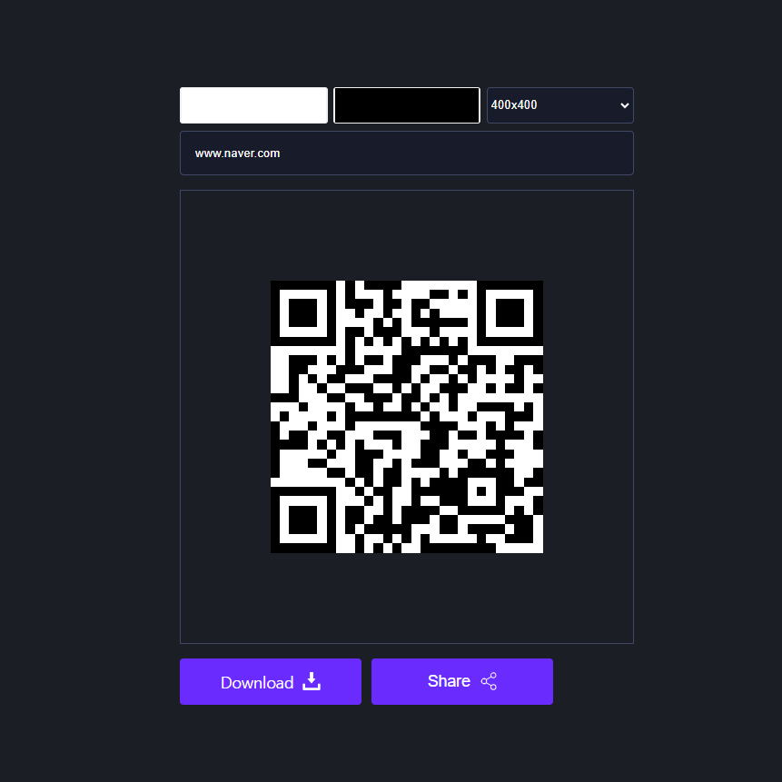

## QR Code Generator

### Screenshot

### 참조 사이트

- [qrcodejs](https://cdnjs.com/libraries/qrcodejs) : JavaScript library for making QRCode

### Points

사용자로부터 입력을 받아 QR 코드를 생성하고, 생성된 QR 코드를 공유할 수 있음.

1. **기본 설정**: `defaultUrl` 변수를 통해 기본 QR 코드 텍스트로 사용할 URL을 정의. `colorLight`, `colorDark`, `text`, `size` 변수를 통해 QR 코드의 밝은 색상, 어두운 색상, 텍스트, 크기를 설정.
2. **색상 및 텍스트 변경 핸들러**: `handleDarkColor`, `handleLightColor`, `handleQRText` 함수는 각각 어두운 색상, 밝은 색상, QR 코드 텍스트를 변경할 때 호출. 이 함수들은 변경 사항을 전역 변수에 반영하고, `generateQRCode` 함수를 호출하여 QR 코드를 다시 생성.
3. **QR 코드 생성**: `generateQRCode` 함수는 QRCode 라이브러리를 사용하여 QR 코드를 생성. 이 함수는 설정된 `text`, `size`, `colorLight`, `colorDark` 값을 사용하여 QR 코드를 생성하고, `qrContainer` 내부의 HTML을 비운 후 생성된 QR 코드를 추가. 또한, `download` 링크의 `href` 속성을 QR 코드 이미지의 데이터 URL로 설정.
4. **QR 코드 공유**: `handleShare` 함수는 생성된 QR 코드를 공유하기 위해 호출. 이 함수는 `resolveDataUrl` 함수를 사용하여 QR 코드의 데이터 URL을 가져온 후, 이를 기반으로 파일을 생성하고, `navigator.share` API를 사용하여 파일을 공유. 만약 브라우저가 공유 기능을 지원하지 않으면, 사용자에게 알림을 표시.
5. **QR 코드 크기 변경**: `handleSize` 함수는 QR 코드의 크기를 변경할 때 호출. 이 함수는 QR 코드의 크기를 변경하고, `generateQRCode` 함수를 호출하여 QR 코드를 다시 생성.
6. **데이터 URL 해결**: `resolveDataUrl` 함수는 QR 코드의 이미지 데이터 URL을 해결하기 위해 사용. 이 함수는 QR 코드가 `` 태그나 `<canvas>` 요소로 렌더링되었는지에 따라 해당 요소의 데이터 URL을 반환.
