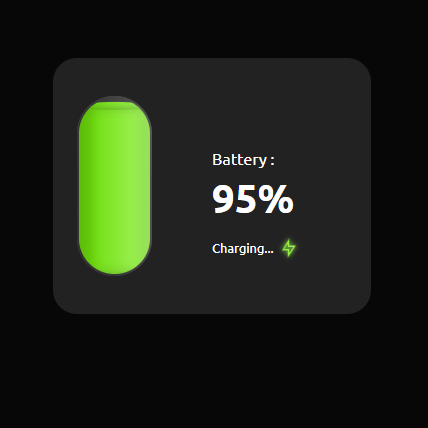

## Detect Device Battery

### Screenshot

### 참조 사이트

- [Remix Icon](https://remixicon.com/)
- [Remix Icon - github](https://github.com/Remix-Design/RemixIcon)

### Points

배터리 상태를 시각적으로 표시하는 기능을 구현한 것. 사용자의 장치 배터리 상태를 나타내는 애니메이션과 정보를 보여줌.

1. `initBattery`: 웹 페이지가 로드될 때 호출되어 배터리 관련 UI를 초기화하고, 배터리 상태를 업데이트하는 로직을 설정. **`navigator.getBattery()`** 메소드를 사용하여 배터리 상태에 접근. 이 메소드는 프로미스(Promise)를 반환하며, 이 프로미스가 해결될 때 배터리 상태 정보를 포함하는 객체를 받음.
2. 배터리 상태 업데이트(`updateBattery`): 배터리 레벨(`batt.level`)을 사용하여 배터리의 현재 충전 수준을 퍼센트(%) 단위로 계산.
   - 배터리 레벨에 따라 다른 UI 변경 사항을 적용.
     - 배터리가 100% 충전된 경우, 'Full battery' 상태 메시지와 함께 녹색 아이콘을 표시.
     - 배터리 레벨이 20% 이하이고 충전 중이 아닌 경우, 'Low battery' 상태 메시지와 함께 붉은색으로 깜빡이는 플러그 아이콘을 표시.
     - 배터리가 충전 중인 경우, 'Charging...' 상태 메시지와 함께 녹색으로 깜빡이는 전기 아이콘을 표시.
   - 배터리 레벨에 따라 배터리 액체의 높이(`batteryLiquid.style.height`)와 색상(`batteryLiquid.classList`)을 조정하여 시각적으로 현재 배터리 상태를 나타냄.
     - 배터리 레벨이 20% 이하일 경우 빨간색, 40% 이하일 경우 주황색, 80% 이하일 경우 노란색, 그 이상일 경우 녹색으로 표시.
3. 이벤트 리스너: `batt.addEventListener`를 통해 배터리 충전 상태 변화(`chargingchange`)와 배터리 레벨 변화(`levelchange`) 이벤트에 대한 리스너를 추가합니다. 이 이벤트들이 발생할 때마다 `updateBattery` 함수를 호출하여 UI를 즉시 업데이트합니다.
