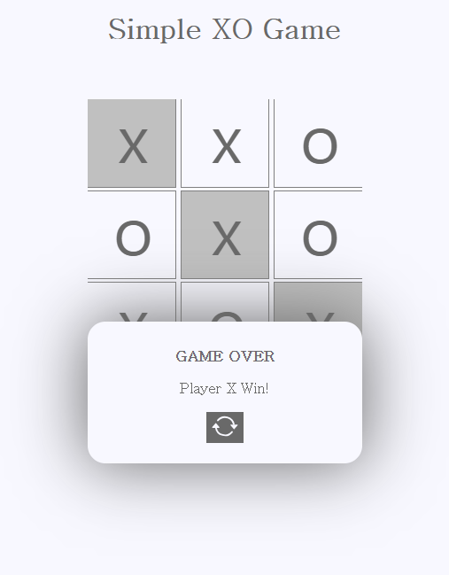

## XO Game

### Screenshot

### Points

HTML의 `` 태그를 활용한 간단한 틱택토 게임. `` 태그들은 게임판의 각 칸을 나타내며, 각 `` 태그는 `data-player` 속성을 사용하여 해당 칸이 어떤 플레이어에 의해 선택되었는지를 표시함. 게임 오버나 무승부 상황에서는 `
` 태그를 생성하여 알림을 표시하고, 사용자가 다시 시작 버튼을 클릭하면 게임이 재시작됨.

1. **play 함수**: 사용자가 게임판의 한 칸을 클릭할 때 호출됨. 선택한 칸이 비어있고 게임이 끝나지 않았다면, 해당 칸에 현재 플레이어의 심볼(`'x'` 또는 `'o'`)을 표시하고, 플레이어를 변경. 그 후, 승리 조건을 검사하고, 모든 칸이 다 찼는데 승리자가 없다면 무승부 처리.
2. **checkWinner 함수**: 승리 조건을 검사합니다. 3개의 칸이 동일한 플레이어의 심볼로 채워져 있다면, 해당 플레이어가 승리하고 게임이 종료됨.
3. **playAgain 함수**: 게임을 다시 시작. 게임 오버나 무승부 알림을 제거하고, 게임 상태를 초기화.
4. **resetGame 함수**: 게임판을 초기화. 모든 `` 태그의 내용을 비우고, 데이터 속성을 초기화.
5. **gameOver 함수**: 한 플레이어가 승리했을 때 호출됨. 게임 오버 알림을 표시하고, 게임 오버 상태를 true로 설정.
6. **draw 함수**: 게임이 무승부로 끝났을 때 호출됨. 무승부 알림을 표시하고, 게임 오버 상태를 true로 설정.
