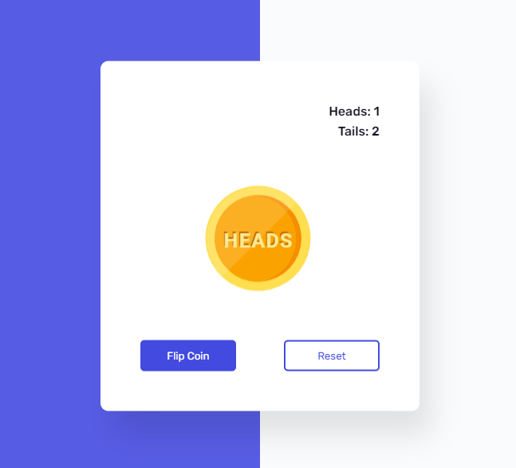

## Flip a Coin Game

### Screenshot

### Points

동전 던지기 애니메이션과 결과 통계를 관리하는 게임. 사용자가 동전을 던지거나 결과를 초기화할 수 있음

1. **동전 던지기 기능 (`flipBtn`의 클릭 이벤트 리스너)** : 동전을 던지는 버튼에 클릭 이벤트 리스너를 추가합니다.
   - `Math.random()` 함수를 사용하여 0 또는 1 중 하나를 무작위로 생성. 이 값은 동전의 앞면 또는 뒷면을 결정.
   - 동전 이미지의 애니메이션을 초기화(`coin.style.animation = 'none';`).
   - 무작위 값(`i`)이 참(1)인 경우 동전 앞면 애니메이션을 실행하고, 거짓(0)인 경우 동전 뒷면 애니메이션을 실행. 애니메이션은 3초 동안 진행.
   - 앞면 또는 뒷면이 나온 횟수를 증가시킴.
   - 3초 후에 통계를 업데이트하는 `updateStats` 함수를 호출.
   - 버튼을 일시적으로 비활성화하여 중복 클릭을 방지(`disableButton` 함수 호출)
2. **`updateStats` 함수** : 앞면과 뒷면이 나온 횟수를 각각 화면에 표시. HTML 요소의 `textContent`를 사용하여 횟수를 업데이트.
3. **`disableButton` 함수** : 동전 던지기 버튼을 일시적으로 비활성화하여, 사용자가 동전 던지기 애니메이션이 진행되는 동안 버튼을 다시 클릭하지 못하게 함. 3초 후에 버튼을 다시 활성화.
4. **결과 초기화 (`resetBtn`의 클릭 이벤트 리스너)** : 동전 애니메이션을 초기화하고, 앞면과 뒷면이 나온 횟수를 모두 0으로 설정. 변경된 결과를 화면에 반영하기 위해 `updateStats` 함수를 호출.
