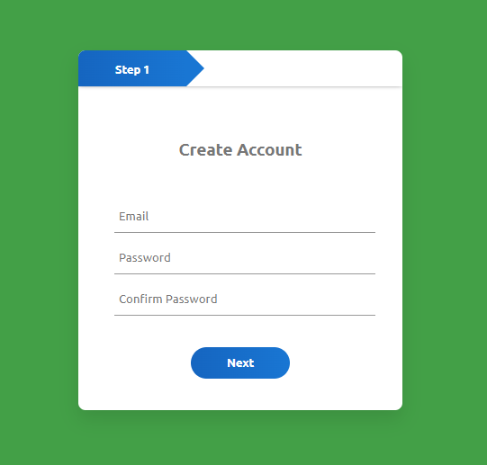

## Multi Step Form

### Screenshot

### Points

Multi Step Form은 CSS를 통해 각 폼의 위치를 조정하여 현재 어느 단계에 있는지를 시각적으로 나타냄. 사용자가 '다음'과 '뒤로' 버튼을 통해 각 단계를 이동할 수 있음. 프로그레스 바는 현재 진행 상태를 나타내는 시각적 요소로, 각 단계에 따라 너비가 조정됨.

- `next1.onclick`: 첫 번째 '다음' 버튼을 클릭했을 때, `form1`은 왼쪽으로 -450px 이동하고, `form2`는 왼쪽으로 40px 위치로 이동해서 사용자에게 보임. 프로그레스 바의 너비는 240px으로 설정됨.
