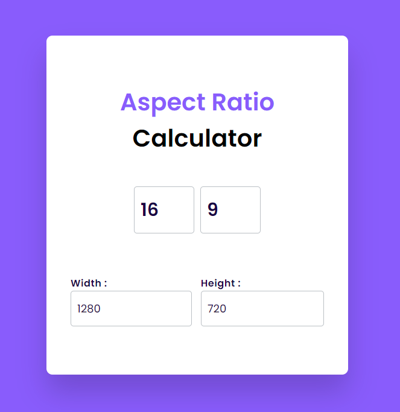

## Aspect Ratio Calculator

### Screenshot

### Points

사용자가 입력한 가로 세로 비율을 바탕으로 가로 길이 또는 세로 길이를 자동으로 계산해주는 계산기. 사용자가 비율(가로:세로), 가로 길이, 또는 세로 길이 중 하나를 변경할 때, 나머지 두 값 중 하나를 비율에 맞게 자동으로 조절해 줌.

- `calculateWidth`: 세로 길이(`height`)와 비율(`ratioWidth` / `ratioHeight`)을 사용해 가로 길이(`width`)를 계산하고, 그 결과를 `width` input에 표시. 계산된 가로 길이는 소수점 둘째 자리까지 표현.
- `calculateHeight`: 가로 길이(`width`)와 비율(`ratioWidth` / `ratioHeight`)을 사용해 세로 길이(`height`)를 계산하고, 그 결과를 `height` input에 표시. 계산된 세로 길이는 소수점 둘째 자리까지 표현.
- `height.addEventListener('input', calculateWidth)`: 세로 길이(`height`) 입력 필드에 값이 입력될 때마다 `calculateWidth` 함수를 호출하여 가로 길이를 자동으로 계산.
- `width.addEventListener('input', calculateWidth)`: 가로 길이(`width`) 입력 필드에 값이 입력될 때 `calculateHeight` 함수가 호출하여 세로 길이를 자동으로 계산.
- `ratioHeight.addEventListener('input', calculateWidth)`: 세로 비율(`ratioHeight`) 입력 필드에 값이 입력될 때마다 `calculateWidth` 함수를 호출합니다.
- `ratioWidth.addEventListener('input', calculateWidth)`: 가로 비율(`ratioWidth`) 입력 필드에 값이 입력될 때마다 `calculateHeight` 함수를 호출합니다.
