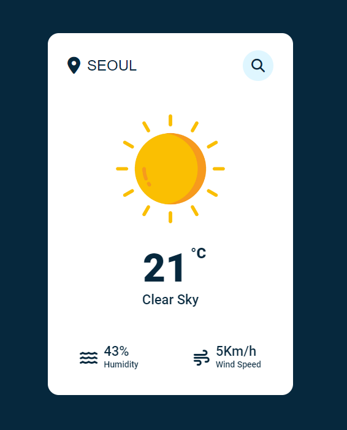

## Weather App

### Screenshot

### 참조 사이트

- [Open Weather](https://openweathermap.org/)

### Points

사용자가 입력한 도시명을 바탕으로 해당 도시의 날씨 정보를 OpenWeatherMap API를 통해 가져와서 보여줌. 비동기 방식으로 API를 호출하고, 결과에 따라 사용자에게 동적으로 정보를 제공함.

1. **API 호출**: 사용자가 입력한 도시명을 바탕으로 OpenWeatherMap API에 요청을 보냅니다. 요청 URL에는 도시명, 온도 단위(섭씨), 그리고 API 키가 포함됨.
2. **응답 처리**: API로부터 받은 응답을 JSON 형식으로 변환한 후 처리.
   - 만약 도시를 찾을 수 없는 경우(`json.cod`가 '404'인 경우), 날씨 정보 박스와 세부 정보를 숨기고, 오류 메시지를 표시.
   - 도시를 찾은 경우, 오류 메시지를 숨기고 날씨 정보 박스와 세부 정보를 업데이트하여 표시.
3. **날씨 정보 업데이트**: 날씨 정보에 따라 적절한 이미지를 선택하고, 온도, 날씨 설명, 습도, 바람 속도를 각각의 HTML 요소에 표시.
4. **애니메이션 추가**: 날씨 정보 박스와 세부 정보 박스에 'fadeIn' 클래스를 추가하여 애니메이션 효과를 줌.
5. **컨테이너 크기 조정**: 날씨 정보가 성공적으로 로드되면, 컨테이너의 높이를 조정하여 모든 정보를 보여줌.
