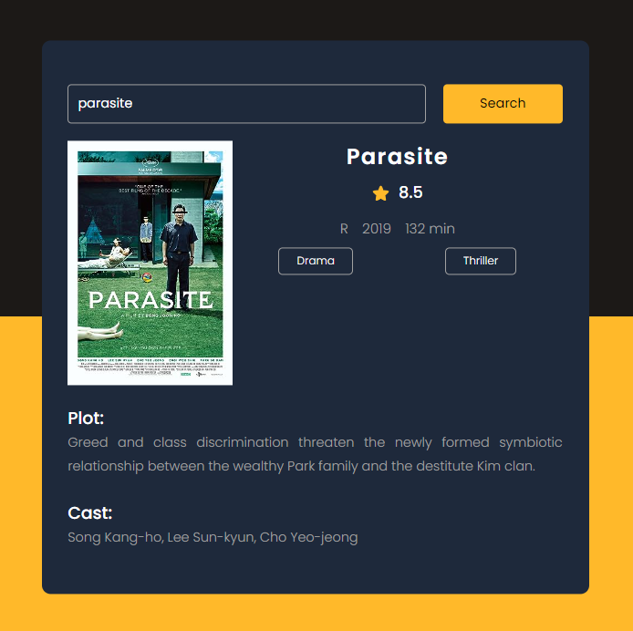

## Movie Guide App

### Screenshot

### 참조 사이트

- [OMDb API - The Open Movie Database](https://www.omdbapi.com/)

### Points

사용자가 영화 이름을 입력하고 검색 버튼을 클릭하면, Open Movie Database (OMDb) API를 통해 해당 영화에 대한 정보를 검색하고 결과를 화면에 표시함.

1. **`getMovie` 함수:**
   - 사용자가 입력한 영화 이름을 기반으로 OMDb API를 호출하여 영화 정보를 검색.
   - 사용자가 입력한 영화 이름을 `movieName` 변수에 저장.
   - API URL을 구성합니다. 여기서 `${movieName}`은 사용자가 입력한 영화 이름을, `${key}`는 OMDb API 키를 나타냄.
   - 입력한 영화 이름이 비어 있으면, 사용자에게 영화 이름을 입력하라는 메시지를 표시.
   - 그렇지 않으면, `fetch` 함수를 사용해 API를 호출. 호출 결과는 JSON 형식으로 변환되고, 이 데이터를 사용해 화면에 영화 정보를 표시.
2. **API 호출 결과 처리:**
   - API 호출이 성공하고 영화 정보가 반환되면 (`data.Response == 'True'`), 영화 포스터, 제목, 평점, 분류(Rated), 개봉 연도, 상영 시간, 장르, 줄거리, 출연진 등의 정보를 화면에 표시.
   - 영화 장르는 쉼표로 구분된 문자열이므로, `.split(',')`을 사용해 배열로 변환한 후 `.join('

')`을 사용해 각 장르를 별도의 `
` 태그로 둘러싸서 표시.
   - 검색 결과가 없거나 오류가 발생한 경우 (`data.Response != 'True'`), 사용자에게 오류 메시지를 표시.
