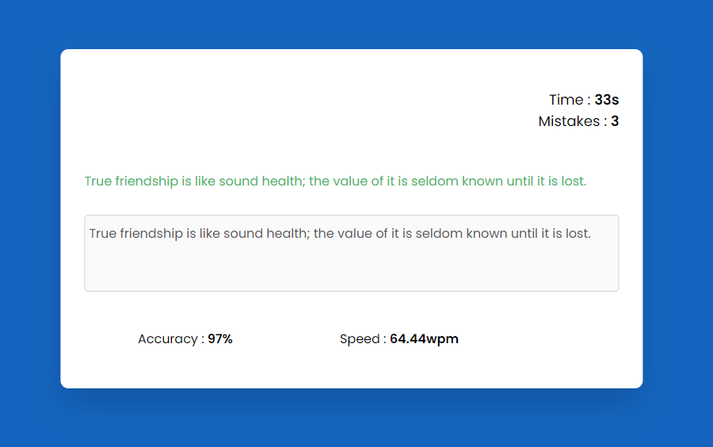

## Type Test App

### Screenshot

### 참조 API

- [Random quotes api](https://api.quotable.io/random?minLength=80&maxLength=100)

### Points

사용자가 타이핑하는 동안 실시간으로 입력을 검사하고, 타이핑 속도와 정확도를 측정하는 간단한 타이핑 테스트 어플리케이션.

1. 주요 함수
   - `renderNewQuote`: API에서 새로운 인용구를 가져와 화면에 표시. 인용구의 각 문자를 ``로 감싸서 `quoteSection`에 추가.
   - `updateTimer`: 매 초마다 호출되어 화면에 남은 시간을 업데이트하고, 시간이 다 되면 결과를 표시.
   - `displayResult`: 타이핑 테스트가 끝났을 때 결과를 계산하여 화면에 표시. 타이핑 속도(단어/분), 정확도(%)를 계산.
   - `startTest`: 타이핑 테스트를 시작할 때 초기 설정. 타이머를 시작하고, 필요한 변수들을 초기화.
2. 이벤트 리스너
   - `userInput.addEventListener('input', ...)`: 사용자가 입력할 때마다 호출. 사용자의 입력과 인용구를 비교하여 정확도를 판별하고, 모든 문자가 정확하게 입력되었는지 확인. 오류가 있을 경우 `mistakes`를 증가시키고 해당 문자에 'fail' 클래스를 추가. 모든 문자가 정확하게 입력되면 결과를 표시.
3. 결과 표시 로직 (`displayResult`)
   - 사용자의 타이핑 속도(WPM, Words Per Minute)와 정확도를 계산하여 표시.
   - WPM은 `time`이 0이 아닐 경우, 분 단위로 변환. `time`이 0인 경우, `timeTaken`을 1로 설정하여 나누기 연산 시 오류가 발생하지 않도록 함.
   - 정확도는 정확하게 입력된 문자의 비율로 계산. 사용자가 아무것도 입력하지 않았을 경우를 대비하여, 입력 길이가 0이면 정확도를 0%로 설정.
