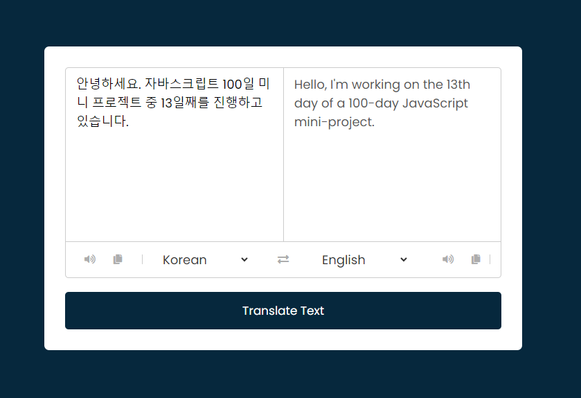

## Translator App

### Screenshot



### 참조 API

- [MyMemory Translation](https://mymemory.translated.net/)

### Points

웹 기반 번역 및 텍스트 처리 애플리케이션. 사용자가 입력한 텍스트를 번역하고, 결과를 복사하거나 음성으로 들을 수 있는 기능을 제공. 또한, 사용자가 두 언어를 쉽게 교환할 수 있도록 지원하며, 입력란의 텍스트를 실시간으로 처리하여 사용자 경험을 향상시킴.

1. **국가 코드 및 언어 선택 옵션 설정 :**
   - `selectTag.forEach((tag, id) => {...});` 부분에서는 `selectTag` 배열(언어 선택을 위한 드롭다운 메뉴)의 각 요소에 대해 반복. 이 반복문은 드롭다운 메뉴에 국가 코드와 해당하는 언어 이름을 `option` 태그로 추가.
   - 첫 번째 `select` 태그(`id == 0`)의 경우, `'en-GB'`가 기본 선택으로 설정되고, 두 번째 `select` 태그(`id != 0`)의 경우, `'de-DE'`가 기본 선택으로 설정.
2. **언어 교환 기능 :** `exchageIcon.addEventListener('click', () => {...});` 부분에서는 교환 아이콘을 클릭할 때 입력란(`fromText`, `toText`)과 선택된 언어(`selectTag[0].value`, `selectTag[1].value`)를 서로 바꿈.
3. **입력란 비워질 때 처리 :** `fromText.addEventListener('keyup', () => {...});` 부분에서는 사용자가 `fromText` 입력란에서 키를 누를 때마다 입력란이 비어있는지 확인하고, 비어있다면 `toText` 입력란도 비움.
4. **번역 기능 :**
   - `translateBtn.addEventListener('click', () => {...});` 부분에서는 번역 버튼을 클릭할 때 입력된 텍스트와 선택된 언어 정보를 사용하여 번역을 요청.
   - 요청된 번역은 `https://api.mymemory.translated.net/get` API를 통해 이루어지며, 응답으로 받은 번역된 텍스트는 `toText` 입력란에 표시.
5. **복사 및 음성 변환 기능:**
   - `icons.forEach((icon) => {...});` 부분에서는 각 아이콘(복사 및 음성 변환)에 클릭 이벤트 리스너를 추가.
   - 복사 아이콘 클릭 시, 해당 입력란(`fromText` 또는 `toText`)의 텍스트를 클립보드에 복사.
   - 음성 변환 아이콘 클릭 시, 해당 입력란의 텍스트를 음성으로 변환하여 재생. 이때 사용되는 언어는 선택된 언어(`selectTag[0].value`, `selectTag[1].value`)를 기준으로 함.

`SpeechSynthesisUtterance` : 웹 스피치 API의 일부로, 텍스트를 음성으로 변환할 때 사용되는 객체. 이 객체를 사용하여 음성으로 읽을 텍스트와 관련 설정을 지정할 수 있음.

```js
let utterance;
utterance = new SpeechSynthesisUtterance(fromText.value);
utterance.lang = 'ko-KR';
speechSynthesis.speak(utterance); //speechSynthesis : Web Speech API
```