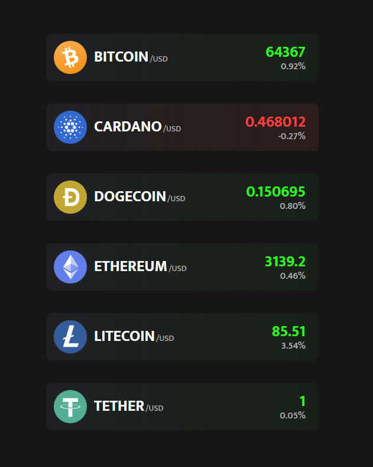

## Crypto Price App

### Screenshot

### 참조 API

- [CoinGecko API](https://www.coingecko.com/ko)

### Points

CoinGecko API로부터 특정 암호화폐의 가격 정보와 24시간 변화율을 가져와 웹 페이지에 동적으로 표시.

1. **fetch API 사용하기**: `fetch` 함수를 사용하여 CoinGecko API에서 암호화폐 가격 정보를 가져옴. 요청된 URL은 bitcoin, tether, ethereum, litecoin, cardano, dogecoin의 가격 정보를 USD 대비하여 요청하며, 24시간 가격 변화율도 포함.
2. **JSON 데이터 처리하기**: 두 번째 `.then()`에서 실제 JSON 데이터를 처리. 먼저 `.container` 클래스를 가진 DOM 요소를 선택하고, `Object.getOwnPropertyNames(json)`을 사용하여 JSON 객체의 속성 이름(여기서는 암호화폐의 id)을 배열로 가져옴.
3. **암호화폐 정보 동적 생성하기**: 가져온 각 암호화폐 id에 대해, 해당 암호화폐의 가격(`price`)과 24시간 변화율(`change`)을 추출. `change`는 소수점 둘째 자리까지 반올림하여 표시.
4. 각 암호화폐에 대해 HTML 요소를 동적으로 생성하여 `.container` 요소에 추가. 생성된 HTML 구조는 각 암호화폐의 로고, 이름, 가격, 그리고 24시간 변화율을 포함. 변화율이 양수일 경우 'rising' 클래스를, 음수일 경우 'falling' 클래스를 부여하여 가격 변화의 방향을 시각적으로 표시.
