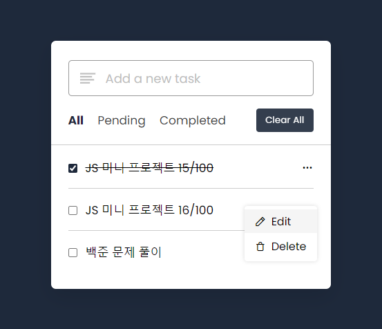

## ToDo App

### Screenshot

### Points

간단한 Todo 리스트를 관리하는 웹 애플리케이션. 사용자는 할 일을 추가, 수정, 삭제할 수 있으며, 할 일의 상태(완료됨, 대기 중)를 변경할 수도 있음.

1. **필터링 기능**: 사용자가 상태에 따라 할 일을 필터링할 수 있도록 버튼에 이벤트 리스너를 추가. 각 버튼은 특정 상태('all', 'completed', 'pending')에 해당하는 할 일을 보여주도록 설정.
2. **할 일 표시하기**: `showTodo` 함수는 현재 상태에 따라 할 일 목록을 필터링하고, 각 할 일을 HTML 리스트 아이템(`li`)으로 변환하여 화면에 표시. 할 일의 상태가 'completed'이면 체크박스를 체크한 상태로 표시.
3. **메뉴 표시하기**: 각 할 일 항목에는 설정 아이콘이 있으며, 이를 클릭하면 수정과 삭제 옵션이 포함된 메뉴가 나타남. `showMenu` 함수는 이 메뉴를 표시하거나 숨기는 역할을 함.
4. **상태 업데이트**: 할 일 옆의 체크박스를 클릭하면, `updateStatus` 함수가 호출되어 해당 할 일의 상태를 'completed' 또는 'pending'으로 변경.
5. **할 일 수정하기**: 사용자가 할 일을 수정하려고 할 때, `editTask` 함수가 호출되어 선택한 할 일의 내용을 입력 필드에 표시. 사용자가 엔터 키를 누르면 변경사항이 저장.
6. **할 일 삭제하기**: `deleteTask` 함수는 사용자가 할 일을 삭제할 수 있도록 함. 삭제하고자 하는 할 일의 인덱스를 사용하여 배열에서 제거.
7. **모두 지우기**: 'clearAll' 버튼은 모든 할 일을 삭제. 이 버튼을 클릭하면, `todos` 배열이 비워지고 변경사항이 로컬 스토리지에 저장.
8. **할 일 추가하기**: 사용자가 입력 필드에 할 일을 입력하고 엔터 키를 누르면, `taskInput` 이벤트 리스너가 새 할 일을 `todos` 배열에 추가. 만약 사용자가 할 일을 수정 중이라면, 선택한 할 일의 내용이 업데이트.
9. **로컬 스토리지 사용**: 사용자의 할 일 목록을 브라우저의 로컬 스토리지에 저장하여, 페이지를 새로고침하거나 닫았다 다시 열어도 할 일 목록이 유지됨.
