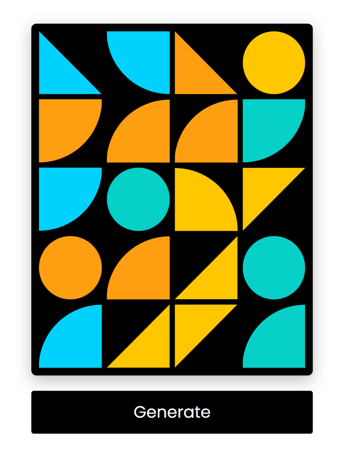

## Geometric Art Generator

### Screenshot

### Points

HTML 문서 내의 특정 요소들의 모양과 색상을 무작위로 변경.

1. **`generatePattern` 함수**:
   - 페이지에 있는 모든 `boxes`를 순회하면서 각 box의 클래스 이름을 초기화하고, 무작위로 선택된 `shapes` 배열과 `colors` 배열의 값을 사용하여 새로운 모양과 배경색을 적용합니다.
   - 모양은 `shapes` 배열에서 무작위로 선택된 항목의 이름을 클래스로 추가함으로써 결정됩니다.
   - 배경색은 `colors` 배열에서 무작위로 선택된 색상 코드를 `backgroundColor` 스타일 속성으로 설정함으로써 적용됩니다.
2. **`clip-path`**:
   - `clip-path`는 CSS 속성으로, 요소의 특정 부분만을 보여주기 위해 사용됩니다. 즉, 요소의 모양을 잘라내어 원하는 형태로 만들 수 있습니다. 예제에서 사용된 `clip-path` 값들은 다음과 같은 의미를 가집니다:
   - `.quad-circle-4 { clip-path: circle(100% at 0 100%); }`: 원의 형태로 클리핑하며, 원의 크기는 요소의 크기에 따라 100%이고, 원의 위치는 요소의 좌측 하단 모서리에서 시작합니다.
   - `.triangle-1 { clip-path: polygon(0 0, 0% 100%, 100% 0); }`: 삼각형의 형태로 클리핑하며, 꼭지점은 요소의 좌측 상단(0 0), 좌측 하단(0% 100%), 우측 상단(100% 0)에 위치합니다.
   - `clip-path` 속성을 사용하면, 복잡한 형태의 디자인도 간단한 CSS 코드로 구현할 수 있어, 웹 디자인에서 매우 유용하게 활용됩니다.
