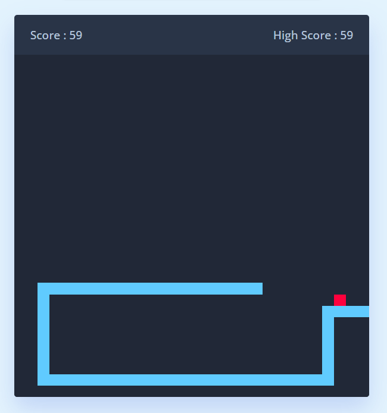

## Snake Game

### Screenshot

### Points

간단한 스네이크 게임 구현. 사용자는 화살표 키 또는 UI 버튼을 사용하여 스네이크의 방향을 제어하며, 먹이를 먹어 점수를 얻고, 자기 자신이나 벽에 부딪히면 게임이 종료됨.

1. **먹이 위치 업데이트 :** `updateFoodPosition` 함수는 먹이의 위치를 게임 보드 내의 랜덤한 위치로 설정.
2. **게임 오버 처리 :** `handleGameOver` 함수는 게임 오버 상황에서 호출되어, 게임을 중지하고, 사용자에게 알림을 보내고, 페이지를 리로드하여 게임을 재시작.
3. **방향 변경 처리 :** `changeDirection` 함수는 사용자의 키 입력을 기반으로 스네이크의 방향을 변경. 이때 스네이크가 현재 이동 방향의 반대로 바로 이동하는 것을 방지함.
4. **UI 컨트롤 버튼 이벤트 바인딩 :** 화면에 나타난 컨트롤 버튼들에 대하여, 클릭 이벤트 리스너를 추가하고, 이를 처리하는 방식으로 방향을 변경할 수 있음.
5. **게임 초기화 및 메인 게임 루프 :** `initGame` 함수는 게임의 메인 루프를 담당. 게임 오버 상태를 검사하고, 먹이를 먹었는지, 스네이크의 머리가 벽이나 자신의 몸통과 부딪히는지 등의 로직을 처리함. 또한, 이 함수는 `setInterval` 메소드에 의해 정해진 간격으로 반복 호출됨.
6. **먹이와 점수 처리 :** 스네이크가 먹이를 먹으면, 점수가 증가하고 최고 점수가 갱신됨. 먹이를 먹을 때마다 스네이크의 길이를 증가시키기 위해 `snakeBody` 배열에 위치를 추가함.
7. **스네이크 이동 처리 :** 스네이크의 위치는 `velocityX`와 `velocityY`에 따라 갱신되며, `snakeBody` 배열은 이 위치들의 이동을 추적함.
8. **HTML 업데이트 :** 게임 보드의 HTML을 업데이트하여 먹이와 스네이크를 그림.
9. **이벤트 리스너 설정 :** 키보드 방향키 입력에 따른 이벤트 리스너를 설정함.
