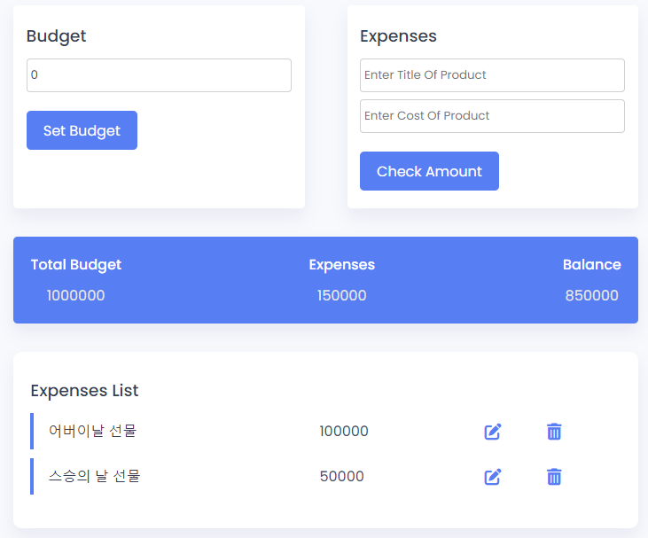

## Budget App

### Screenshot

### Points

사용자의 총 예산과 지출을 관리하는 간단한 웹 애플리케이션. 사용자는 자신의 총 예산을 설정할 수 있으며, 지출 항목을 추가하면서 남은 예산을 추적할 수 있음. 지출 항목은 수정하거나 삭제 가능.

1. **총 예산 설정**: 사용자가 'totalAmountButton' 버튼을 클릭하면, 입력된 총 예산(`totalAmount`)이 화면에 표시되며, 남은 예산(`balanceValue`)이 계산되어 업데이트. 예산이 비어 있거나 음수인 경우 에러 메시지(`errorMessage`)가 표시.
2. **지출 항목 추가**: 사용자가 'checkAmountButton' 버튼을 클릭하여 지출 항목과 금액을 추가 가능. 지출 항목의 이름(`productTitle`)이나 금액(`userAmount`)이 비어 있으면 에러 메시지(`productTitleError`)가 표시됨. 유효한 지출 항목이 제출되면, 해당 지출은 총 지출(`expenditureValue`)에 추가되고, 남은 예산(`balanceValue`)이 업데이트됨. 또한, 지출 항목은 목록(`list`)에 추가되며, 각 항목에는 수정과 삭제 버튼이 포함됨.
3. **지출 항목 수정 및 삭제**: 수정 버튼을 클릭하면, 해당 항목의 이름과 금액이 입력 필드(`productTitle`, `userAmount`)로 로드되며, 다른 수정 버튼이 비활성화됨. 삭제 버튼을 클릭하면, 해당 지출 항목이 목록에서 제거되며, 총 지출과 남은 예산이 업데이트됨.
4. **버튼 비활성화**: `disableButtons` 함수는 모든 수정 버튼의 활성화/비활성화를 제어합니다. 이는 사용자가 한 번에 하나의 항목만 수정할 수 있도록 하기 위함.
5. **동적 요소 생성**: `listCreate` 함수는 새로운 지출 항목을 목록에 추가. 각 항목은 'div' 요소로 생성되며, 해당 항목의 이름과 금액이 표시됨. 또한, 수정과 삭제 버튼이 각각의 항목에 추가됨.
