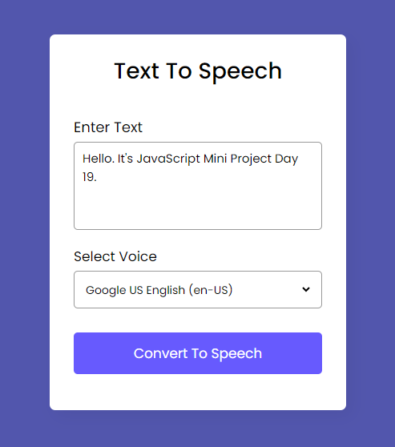

## Text To Speech App

### Screenshot

### Points

텍스트를 음성으로 변환하는 기능. 주요 기능은 사용자가 입력한 텍스트를 음성으로 변환하고, 사용 가능한 음성 옵션을 선택할 수 있게 하는 것.

1. 변수 선언 및 초기화
   - `synth`는 `speechSynthesis` 인터페이스의 인스턴스입니다. 이 인터페이스는 음성 서비스를 제어할 수 있는 메소드와 속성을 제공합니다.
   - `isSpeaking`은 현재 음성이 출력 중인지 아닌지를 추적하는 데 사용되는 불리언 변수입니다.
2. 함수 정의
   - `voices` 함수는 사용 가능한 음성 옵션을 `voiceList` 셀렉트 박스에 추가합니다. 'Google US English' 음성이 기본 선택됩니다.
   - `textToSpeech` 함수는 입력된 텍스트를 음성으로 변환합니다. `SpeechSynthesisUtterance` 객체를 생성하고 선택된 음성으로 설정한 후, `synth.speak()` 메소드를 사용하여 음성으로 변환합니다.
3. 이벤트 리스너
   - `synth.addEventListener('voiceschanged', voices);`는 사용 가능한 음성 목록이 변경될 때마다 `voices` 함수를 호출하여 음성 목록을 갱신합니다.
   - `speechBtn.addEventListener('click', (e) => {...});`는 버튼 클릭 이벤트를 처리합니다. 이 이벤트 리스너 내부에서는 입력된 텍스트의 길이에 따라 음성 변환을 시작하거나, 음성 출력을 일시중지하고 재개하는 기능을 구현합니다.
