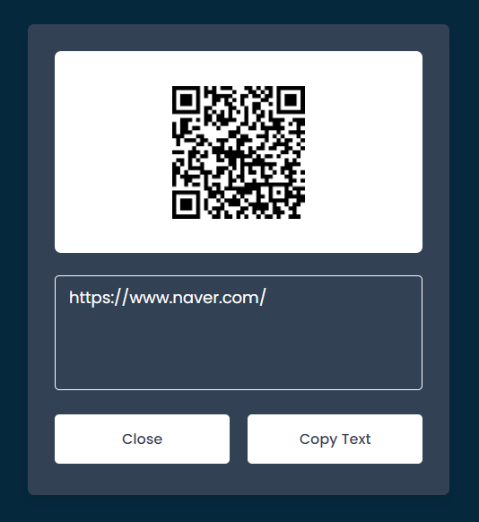

## QR Code Reader

### Screenshot

### 참조 API

- [QR Code Generator](https://goqr.me/api/doc/)

### Points

QR 코드 이미지 파일을 업로드하면, 해당 QR 코드를 스캔하여 그 내용을 표시하고, 사용자가 그 내용을 클립보드에 복사할 수 있게 해주는 코드.

1. **파일 업로드 및 QR 코드 스캔 요청:** 사용자가 파일 입력(input)을 클릭하고 이미지 파일을 선택하면, `change` 이벤트 리스너가 파일을 `fetchRequest` 함수로 전달하여 서버로 POST 요청을 보냄. 이 요청은 QR 코드를 읽기 위해 외부 API(`http://api.qrserver.com/v1/read-qr-code/`)를 사용.
2. **스캔 결과 처리:** 스캔 결과가 성공적으로 반환되면, 결과 데이터를 텍스트 영역에 표시하고, 업로드된 이미지 파일을 `img` 태그의 소스로 설정하여 보여줌. 만약 결과가 없거나 스캔에 실패하면, 사용자에게 실패 메시지를 표시.
3. **클립보드로 복사:** 'Copy' 버튼을 클릭하면, 스캔된 QR 코드의 내용이 클립보드로 복사. 이는 `navigator.clipboard.writeText` 함수를 사용하여 구현.
4. **인터페이스 제어:** 사용자가 QR 코드 이미지를 업로드하면, 결과를 보여주기 위해 특정 클래스(`wrapper`의 `active` 클래스)를 추가하여 결과 화면을 사용자에게 보여줌. 'Close' 버튼을 클릭하면, 이 클래스가 제거되어 결과 화면이 숨겨짐.
