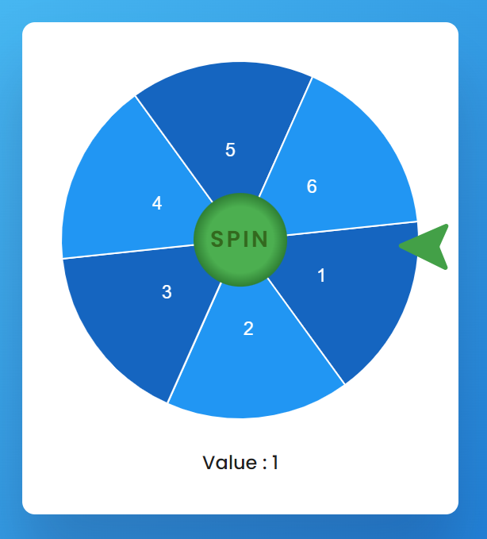

## Spin Wheel App

### Screenshot

### 참조 라이브러리

- [Chart.js](https://cdnjs.com/libraries/Chart.js)
- [chartjs-plugin-datalabels](https://cdnjs.com/libraries/chartjs-plugin-datalabels)

### Points

'행운의 바퀴' 게임을 구현. 'spin' 버튼을 클릭하면, 바퀴가 회전하며, 바퀴가 멈출 때의 값에 따라 결과를 보여줌.

1. **변수 선언 및 초기화**
   - `wheel`, `spinBtn`, `finalValue`: 각각 바퀴, 스핀 버튼, 최종 값이 표시될 HTML 요소를 가리키는 변수.
   - `rotationValues`: 바퀴의 각 구간에 대응되는 최소 각도, 최대 각도, 그리고 그 구간의 값을 담은 객체 배열.
   - `data`: Chart.js 차트에 사용될 데이터로, 모든 구간의 값이 16으로 동일하게 설정.
   - `pieColors`: 차트에 사용될 색상 배열.
2. **차트 생성**
   - `myChart`: Chart.js 라이브러리를 사용하여 바퀴를 나타내는 파이 차트를 생성. 여기서 `wheel`은 차트가 그려질 캔버스 요소의 id. 차트는 6개의 구간으로 나뉘며, 각 구간의 색상과 데이터는 `pieColors`와 `data` 배열로부터 가져옴.
3. **valueGenerator 함수**
   - 사용자가 바퀴를 돌린 후, 최종적으로 바퀴가 멈춘 각도를 기반으로 결과 값을 결정. 이 함수는 바퀴가 멈춘 각도(`angleValue`)를 입력으로 받아, 해당 각도가 속하는 구간의 값을 찾아 HTML 요소에 표시.
4. **스핀 버튼 이벤트 리스너**
   - 사용자가 스핀 버튼을 클릭하면, 버튼이 비활성화되고 바퀴가 회전하기 시작. 바퀴의 회전은 `setInterval` 함수를 사용하여 구현되며, 바퀴는 매 10밀리초마다 회전.
   - `randomDegree`: 0에서 355도 사이의 무작위 각도를 생성하여, 바퀴가 멈출 최종 각도를 결정.
   - `rotationInterval`: 이 변수는 `setInterval` 함수에 의해 반환된 ID를 저장. 이 ID를 사용하여 바퀴가 최종 각도에 도달했을 때 인터벌을 중지.
   - 바퀴 회전 중, 바퀴는 점차적으로 느려짐. 이는 `resultValue`가 감소함에 따라 회전 속도가 줄어들기 때문.
   - 바퀴가 최종 각도에 도달하면, `valueGenerator` 함수를 호출하여 결과 값을 표시하고, 스핀 버튼을 다시 활성화.
