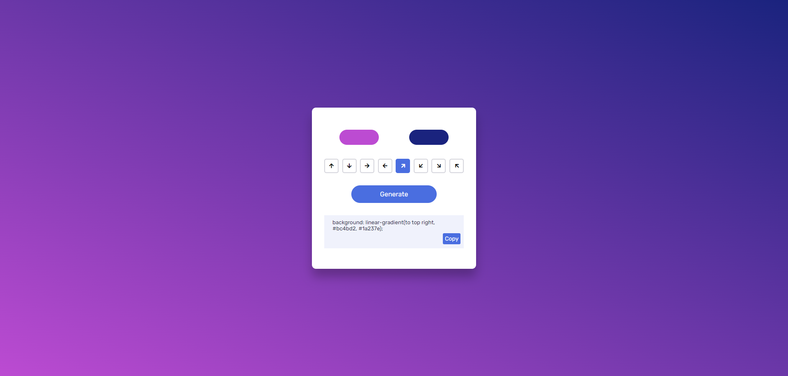

## Gradient Generator

### Screenshot

### Points

두 가지 색상을 선택하고, 그라디언트 방향을 설정하여 최종적으로 그라디언트 배경을 생성하고, 생성된 CSS 코드를 복사할 수 있도록 함.

1. **setDirection 함수**:
   - 그라디언트의 방향을 설정하는 데 사용. 'value' 매개변수로 새로운 방향을 받고, '\_this' 매개변수로는 사용자가 클릭한 버튼 요소를 받음.
   - 페이지 내의 모든 방향 버튼에 대해 'active' 클래스를 제거하고, 클릭된 버튼에만 'active' 클래스를 추가하여 시각적으로 현재 선택된 방향을 나타냄.
   - `currentDirection` 변수를 새로운 값으로 업데이트.
2. **generateCode 함수**:
   - 사용자가 선택한 색상과 방향에 기반하여 그라디언트 CSS 코드를 생성하고, 이를 `outputCode` 요소의 값으로 설정.
   - 또한, 생성된 그라디언트를 페이지의 배경으로 적용하기 위해 `document.getElementsByTagName('body')[0].style.background`에 동일한 그라디언트 값을 설정.
3. **copyText 함수**:
   - `outputCode` 요소의 텍스트를 선택하고, `document.execCommand('copy')`를 사용하여 클립보드에 복사. 이후 사용자에게 'Gradient Copied'라는 알림을 보여줌.
