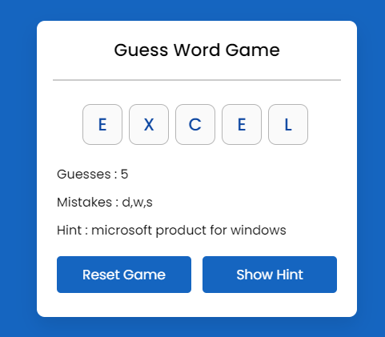

## Guess The Word Game

### Screenshot

### Points

간단한 단어 맞추기 게임을 구현. 제공된 단어의 글자를 하나씩 추측하여 모든 글자를 맞추면 승리. 각 단어에는 힌트가 주어지며, 사용자는 제한된 추측 횟수 내에 단어를 완성해야 함.

1. **startNewGame 함수**
   - 힌트 요소를 숨기고, 무작위 단어를 선택한 후 게임 설정을 초기화.
   - 단어의 각 글자에 대해 입력 필드를 생성.
   - 맞춰야 할 단어의 길이에 따라 최대 추측 횟수를 설정.
2. **handleInput 함수**
   - 사용자 입력을 처리하고 게임 상태를 업데이트하는 함수.
   - 영문자만 입력을 받으며, 이미 추측한 글자는 무시.
   - 입력된 글자가 단어에 포함되어 있는지 확인하고, 맞춘 글자와 틀린 글자를 업데이트.
   - 남은 추측 횟수를 업데이트하고, 승리 또는 패배 조건을 확인.
3. **showHintElement 함수**
   - 힌트 요소를 표시하는 함수.
4. **이벤트 리스너 설정**
   - `inputs` 영역 클릭 시 입력 필드에 포커스가 맞춰지도록 설정.
   - 키보드 입력 시에도 입력 필드에 자동으로 포커스가 맞춰지도록 설정합니다.
