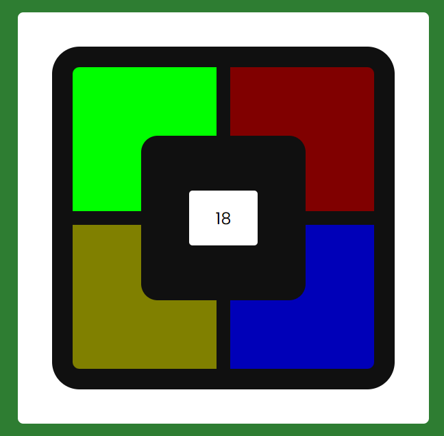

## Simon Game

### Screenshot

### Points

사용자는 시스템이 생성한 색상의 순서를 기억하고, 같은 순서로 색상을 클릭해야 하는 게임. 사용자가 올바른 순서로 색상을 클릭할 때마다 점수가 증가하며, 잘못된 색상을 클릭하면 게임이 종료됨. 비동기 함수인 `async/await`를 사용하여 색상 변경과 딜레이 사이의 순차적 실행을 관리함.

- 주요 함수
  - `getRandomColor` : `colorObj`에서 랜덤하게 하나의 색상 키를 선택하여 반환합니다.
  - `delay` : 주어진 시간(밀리초) 동안 실행을 지연시킵니다.
  - `generateRandomPath` : 새로운 랜덤 색상을 `randomColors` 배열에 추가하고, 사용자에게 색상의 순서를 보여줍니다.
  - `showPath` : 시스템이 생성한 색상의 순서를 사용자에게 보여줍니다. 각 색상은 새로운 색으로 변경되었다가 다시 원래 색으로 돌아갑니다.
  - `endGame` : 게임이 종료되었을 때 호출되며, 사용자의 최종 점수를 보여줍니다.
  - `resetGame` : 게임을 초기화하고 새 게임을 시작합니다.
  - `handleColorClick` : 사용자가 색상을 클릭했을 때 호출되는 함수로, 클릭한 색상이 올바른 순서인지 검사하고, 게임의 진행 상태를 업데이트합니다.
