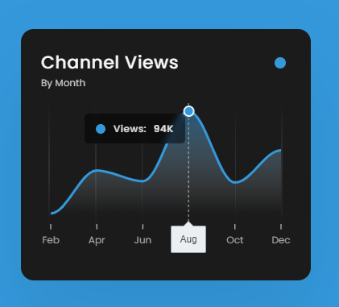

## Apex Charts

### Screenshot

### 참조 라이브러리

[APEXCHARTS.JS](https://apexcharts.com/)

### Points

ApexCharts 라이브러리를 사용하여 웹 페이지에 영역 차트(Area Chart)를 생성하고 렌더링하는 스크립트. ApexCharts는 모던 웹 애플리케이션에 적합한 대화형 차트를 쉽게 만들 수 있게 해주는 JavaScript 차트 라이브러리. 웹 페이지에 영역 차트를 표시하는 데 필요한 모든 설정을 포함하고 있으며, 차트의 시각적 요소(색상, 폰트, 그라디언트 등)를 세밀하게 조정하는 다양한 옵션을 제공함.

- **차트 옵션 설정 (`chartOptions`)**: 차트의 모양, 스타일, 데이터 등을 정의.
  - `chart`: 차트의 유형(`type: 'area'`), 크기(`height: 180`), 툴바 및 줌 기능 설정 등을 포함.
  - `colors`: 차트의 주 색상을 설정(`'#3498db'`).
  - `series`: 차트에 표시될 데이터 시리즈를 정의. 이 예에서는 "Views"라는 이름의 시리즈가 있으며, 6개의 데이터 포인트를 포함.
  - `dataLabels`: 데이터 라벨의 표시 여부를 설정(`enabled: false`).
  - `stroke`: 선의 너비와 곡선 스타일을 정의.
  - `fill`: 차트 영역의 채움 스타일을 그라디언트로 설정.
  - `xaxis`와 `yaxis`: x축과 y축의 설정을 정의. 여기서는 x축에 월별 카테고리를 지정하고, y축은 표시하지 않음(`show: false`).
  - `grid`: 그리드 라인의 스타일을 설정.
  - `tooltip`: 마우스 오버 시 보이는 툴팁의 설정을 정의.
  - `markers`: 데이터 포인트에 대한 마커 표시 여부를 설정(`show: false`).
