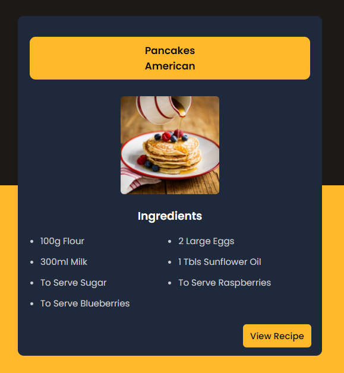

## Recipe Guide App

### Screenshot

### 참조 API

[TheMealDB](https://www.themealdb.com/)

### Points

입력한 음식 이름을 기반으로 외부 API에서 데이터를 가져와 웹 페이지에 동적으로 표시하는 기능. 검색 결과에 해당하는 음식의 이름, 지역, 이미지, 재료 목록, 레시피를 표시하며, 레시피를 보여주거나 숨기는 기능 포함.

1. **API 호출**: `fetch`를 사용하여 외부 API에서 데이터를 가져옴.
   - `searchBtn` 클릭 시 `searchMeal` 함수 호출.
   - `searchInput` 필드에서 엔터 키(키 코드 13)를 누를 때 `searchMeal` 함수 호출.
2. **이벤트 리스너**: 버튼 클릭과 키보드 입력에 대한 이벤트 리스너를 설정.
   - `userInput`을 통해 사용자 입력을 가져오고, 입력이 비어 있으면 경고 메시지를 표시.
   - API를 호출하여 데이터를 가져오고, 성공 시 결과를 HTML에 동적으로 삽입.
   - 검색된 음식이 없을 경우 경고 메시지를 표시.
   - `getIngredients` 함수로 재료 목록을 생성.
   - 레시피 표시 및 숨기기 버튼을 설정.
3. **결과 표시**: 검색 결과를 HTML에 동적으로 삽입.
   - `meal` 객체에서 재료와 측정값을 가져와 HTML 목록으로 변환.
4. **레시피 보기/숨기기**: 레시피를 보여주거나 숨기는 기능을 제공.
   - `hideRecipe`: 레시피를 숨김.
   - `showRecipe`: 레시피를 표시.
