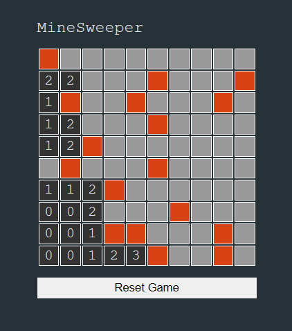

## Minesweeper Game

### Screenshot

### Points

지뢰찾기 게임을 생성하는 코드.

1. `generateGrid` 함수
   - 게임이 시작될 때, 10x10 그리드를 생성.
   - 각 셀(`cell`)에는 클릭 이벤트 핸들러가 할당되어, 셀을 클릭하면 `init` 함수가 실행됨.
   - 각 셀은 처음에 지뢰(`mine`) 속성을 `false`로 가짐.
   - 마지막으로 `generateMines` 함수를 호출하여 지뢰를 생성.
2. `generateMines` 함수
   - 20개의 지뢰를 무작위 위치에 배치.
   - `testMode`가 `true`일 경우, 지뢰 위치에 'X'를 표시합니다.
3. `revealMines` 함수
   - 모든 지뢰를 화면에 표시. 이 함수는 게임이 끝났을 때 호출.
4. `checkGameComplete` 함수
   - 사용자가 모든 지뢰가 아닌 셀을 클릭했는지 확인.
   - 만약 모든 지뢰가 아닌 셀이 클릭되었다면, 게임이 완료되었음을 알림.
5. `init` 함수
   - 사용자가 셀을 클릭했을 때 호출.
   - 만약 클릭한 셀이 지뢰라면, 게임을 잠그고(`lockGame = true`), 모든 지뢰를 표시.
   - 지뢰가 아닌 셀을 클릭했다면, 주변의 지뢰 수를 계산하여 해당 셀에 표시.
   - 주변에 지뢰가 하나도 없다면, 주변 셀들을 재귀적으로 클릭 처리.
   - 마지막으로 `checkGameComplete` 함수를 호출하여 게임 완료 여부를 확인함.
