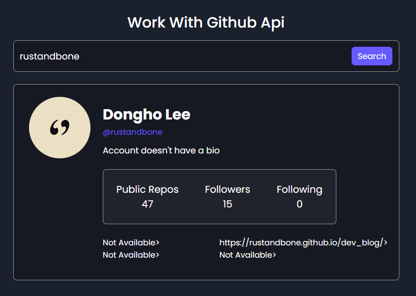

## Github Api

### Screenshot

### 참조 API

[Github API](https://api.github.com/users)

### Points

Github 사용자의 정보를 검색하고 해당 정보를 웹 페이지에 표시.

1. 사용자 이름 입력 받기 : `id`가 `searchInput`인 HTML 요소로부터 값을 가져와 `username` 변수에 저장. Github API 호출에 사용될 사용자 이름.
2. Github API 호출 : `fetch` 함수를 사용하여 비동기적으로 Github API를 호출. URL에는 앞서 얻은 사용자 이름이 포함. 응답(Response) 객체에서 JSON 포맷의 데이터를 비동기적으로 추출하여 `data` 변수에 저장.
3. 응답 처리 : 응답이 성공적인지 확인. 성공적인 경우, HTML 요소를 업데이트하여 사용자 정보를 표시. 만약 요청이 실패하면, 응답으로부터 받은 메시지(`data.message`)를 `alert` 함수를 통해 사용자에게 알림.
4. 사용자 정보 표시 : 사용자 정보를 표시하기 위해 `.details` 클래스를 가진 컨테이너의 display 스타일을 `flex`로 설정. 그런 다음 `id`가 `result`인 HTML 요소의 `innerHTML` 속성을 사용하여 사용자 정보를 동적으로 생성하고 삽입. 이 정보에는 프로필 이미지, 이름(또는 로그인 아이디), 사용자 이름, 자기소개, 공개 저장소 수, 팔로워 수, 팔로잉 수, 위치, 블로그 URL, 트위터 사용자 이름, 회사 정보 등이 포함됨.
