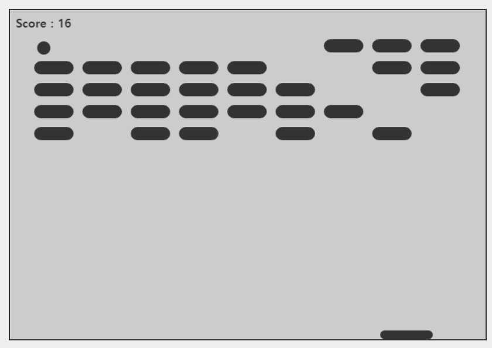

## Breakout Game

### Screenshot

### Points

HTML5 `<canvas>` 요소를 사용하여 블록 깨기 게임을 구현. 마우스를 움직여 패들을 조작하고, 공을 튕겨 블록을 깨뜨림.

1. 변수 선언 및 초기화
   - `canvas`, `ctx`: `<canvas>` 요소와 그려질 2D 컨텍스트.
   - `ballRadius`, `x`, `y`, `dx`, `dy`: 공의 반지름, 초기 위치(x, y), 이동 방향 및 속도(dx, dy).
   - `paddleHeight`, `paddleWidth`, `paddleX`: 패들의 높이, 너비와 초기 위치.
   - `rowCount`, `columnCount`, `brickWidth`, `brickHeight`, `brickPadding`, `topOffset`, `leftOffset`, `score`: 블록의 행과 열 수, 각 블록의 너비와 높이, 블록 사이의 간격, 상단 및 좌측 여백, 점수.
   - `bricks`: 블록의 상태(보이는 상태인지)를 저장하는 배열
2. 함수
   - `mouseMoveHandler`: 마우스 움직임에 따라 패들의 위치를 조정.
   - `drawPaddle`, `drawBall`, `drawBricks`: 패들, 공, 블록을 그림.
   - `trackScore`: 점수를 화면에 표시.
   - `hitDetection`: 공과 블록의 충돌을 감지하여 점수를 계산하고, 모든 블록이 깨졌을 경우 승리 메시지를 표시.
   - `init`: 게임의 주요 로직을 실행하는 함수. 공의 위치를 업데이트하고, 공이 화면 가장자리에 닿으면 방향을 바꾸며, 패들에 닿으면 방향을 바꿈. 게임 오버 조건을 체크.
3. 게임 로직 실행
   - `setInterval(init, 10);`: `init` 함수를 10밀리초 간격으로 반복 실행하여 게임 로직을 지속적으로 업데이트.
