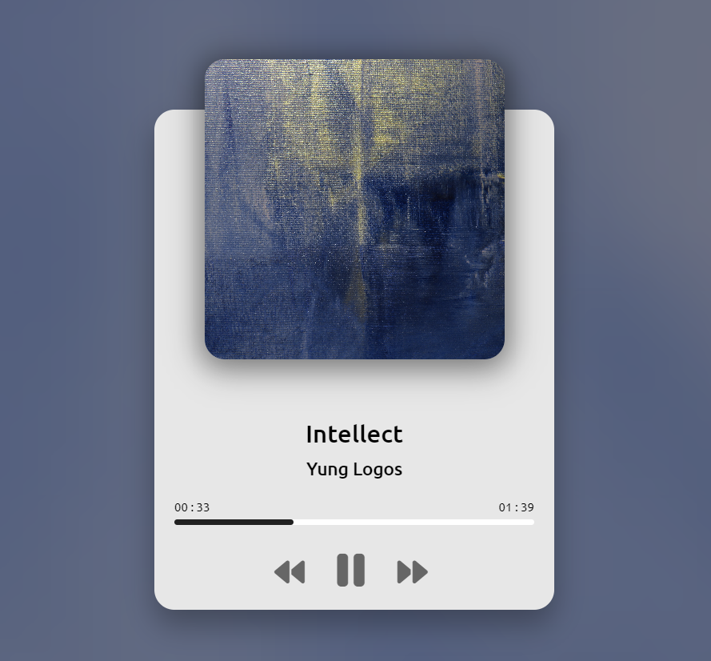

## Music Player App

### Screenshot

### Points

음악 플레이어의 기능을 구현. 음악 재생, 일시정지, 이전/다음 곡 전환, 진행 상태 바 업데이트 및 사용자가 진행 상태 바를 클릭하여 재생 시간을 조정할 수 있는 기능을 포함.

1. **변수 선언 및 초기화:**
   - `const music = new Audio();`를 통해 새로운 오디오 객체를 생성.
   - `songs` 배열은 각 곡의 경로, 이름, 커버 이미지, 아티스트 정보를 포함.
2. **함수 정의:**
   - `togglePlay`: 재생 중이면 음악을 일시 중지하고, 그렇지 않으면 음악을 재생.
   - `playMusic` 및 `pauseMusic`: 각각 음악을 재생하거나 일시 중지. 재생/일시 중지 버튼의 클래스와 속성을 변경하여 아이콘과 툴팁을 업데이트.
   - `loadMusic`: 선택된 곡의 정보를 바탕으로 오디오 소스, 이미지, 제목, 아티스트를 업데이트.
   - `changeMusic`: 다음 또는 이전 곡으로 변경. 방향(-1 또는 1)에 따라 `musicIndex`를 조정하고, `loadMusic` 함수를 호출하여 정보를 업데이트한 후 자동으로 재생을 시작.
   - `updateProgressBar`: 음악의 현재 재생 시간과 전체 길이에 따라 진행 상태 바를 업데이트.
   - `setProgressBar`: 사용자가 진행 상태 바를 클릭했을 때 음악의 재생 시간을 조정.
3. **이벤트 리스너:**
   - 재생, 이전, 다음 버튼에 대한 클릭 이벤트를 처리하여 `togglePlay`, `changeMusic` 함수를 호출.
   - 음악이 끝났을 때 자동으로 다음 곡으로 넘어가도록 `ended` 이벤트에 대한 처리를 추가.
   - 음악 재생 시간이 업데이트될 때마다 진행 상태 바도 업데이트하도록 `timeupdate` 이벤트를 처리.
   - 사용자가 진행 상태 바를 클릭했을 때 재생 시간을 조정할 수 있도록 클릭 이벤트를 처리.
4. **초기 곡 로드:**
   - 스크립트가 실행될 때 첫 번째 곡을 로드하기 위해 `loadMusic` 함수를 호출.
