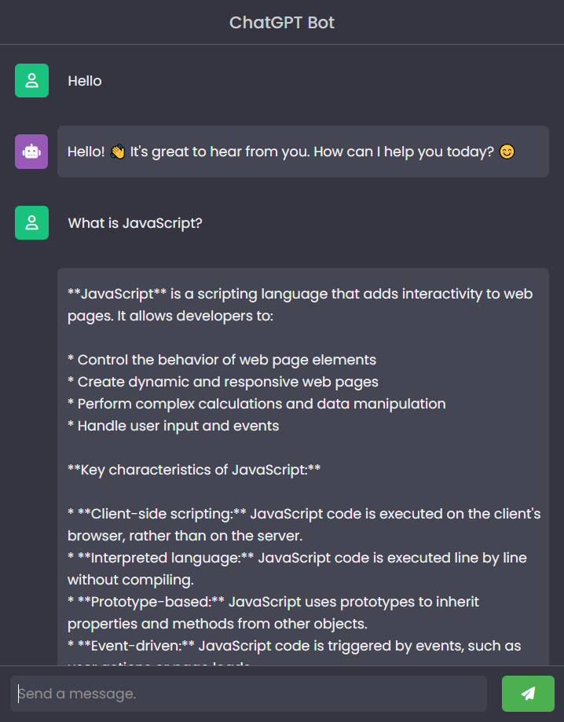

## ChatGPT Bot

### Screenshot

### 참조 API

[OpenAI API | GPT 3.5 Turbo](https://rapidapi.com/pk-ai-pk-ai-default/api/openai-api-gpt-3-5-turbo/)

### Points

ChatGPT와 채팅 인터페이스를 구현. 사용자의 메시지 입력을 받아 처리하고, ChatGPT의 응답을 생성.

1. **변수 선언 및 초기화**:
   - `chatLog`, `userInput`, `sendButton`, `buttonIcon`, `info` 등의 변수에 HTML 문서 내의 특정 요소들을 연결. 이들은 채팅 로그를 표시하고, 사용자 입력을 받아 처리하며, 정보를 표시하는 등의 역할.
2. **이벤트 리스너 추가**:
   - `sendButton`에 클릭 이벤트 리스너를 추가하여 `sendMessage` 함수를 호출.
   - `userInput`에는 키업(keyup) 이벤트 리스너를 추가하여, 사용자가 'Enter' 키를 누를 때 `sendMessage` 함수가 호출되도록 함.
3. **`sendMessage` 함수**:
   - 사용자가 입력한 메시지를 가져와 공백을 제거.
   - 메시지가 빈 문자열이라면 아무 것도 하지 않고 반환.
   - 메시지가 'developer'라면 특수 메시지를 표시하고, 아이콘을 변경.
   - 그렇지 않은 경우, 입력된 메시지를 `appendMessage` 함수를 사용하여 채팅 로그에 추가.
   - POST 요청을 통해 OpenAI API에 메시지를 전송하고, 응답을 받아 채팅 로그에 추가. 이때 아이콘도 업데이트.
4. **`appendMessage` 함수**:
   - `sender`와 `message`를 인자로 받아, 채팅 로그에 메시지를 추가.
   - 메시지를 보낼 때마다 'info' 요소를 숨기고, 로딩 아이콘을 표시.
   - 새로운 메시지 요소를 생성하고, 사용자 또는 봇에 따라 아이콘을 추가.
   - 생성된 메시지 요소를 `chatLog`에 추가하고, 채팅 로그를 스크롤하여 가장 최신 메시지가 보이도록 함.
5. **에러 처리**:
   - `fetch` 요청이 실패하면 콘솔에 에러를 로그하고, 사용자에게 API 키를 확인하라는 메시지를 표시.
