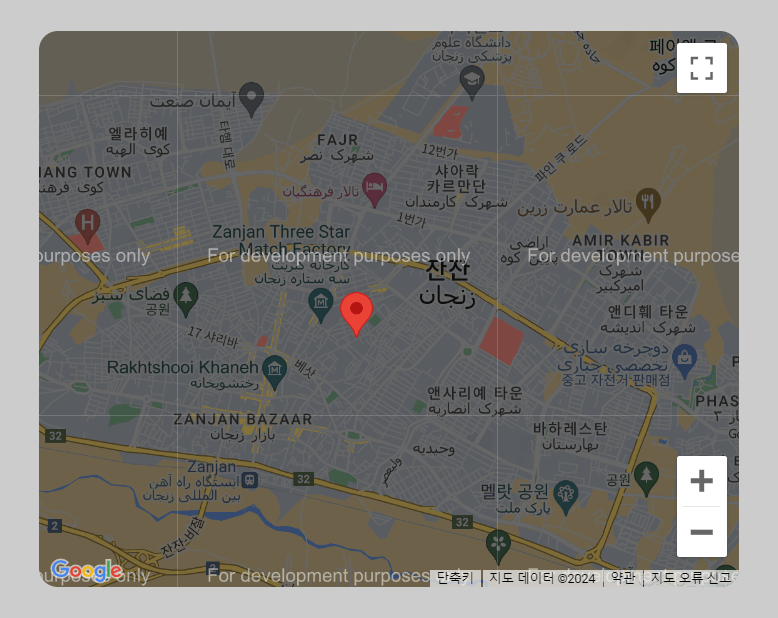

## Google Maps Api

### Screenshot

### 참조 API

[Google Maps API](https://developers.google.com/maps?hl=ko)

### Points

Google Maps API를 사용하여 웹 페이지에 지도를 표시하고, 지도에 마커를 추가하며, 마커를 클릭했을 때 정보창을 표시하는 기능을 구현.

1. `initialize` 함수
   - 지도를 초기화하고 설정, 페이지가 로드될 때 호출.
2. `mapOptions` 객체
   - 지도의 기본 설정을 정의.
     - `zoom`: 지도의 확대 수준을 설정.
     - `center`: 지도의 중심 좌표를 설정. 여기서는 뉴욕시의 좌표(위도 40.71278, 경도 -74.006)로 설정.
     - `mapTypeId`: 지도의 유형을 설정. 여기서는 도로맵(ROADMAP)으로 설정. 다른 옵션으로는 `SATELLITE`, `HYBRID`, `TERRAIN` 등이 있음.
     - `minZoom`: 지도의 최소 확대 수준을 설정.
3. `map`, `infoWindow`, `marker` 객체
   - `map` 객체는 `google.maps.Map` 생성자를 사용하여 지도 인스턴스를 생성. 이때, `mapOptions`를 사용하여 지도의 설정을 적용. `document.getElementById('map')`는 지도를 표시할 HTML 요소를 가져옴.
   - `infoWindow` 객체는 정보창을 생성. 이 정보창은 마커를 클릭했을 때 표시될 내용.
   - `marker` 객체는 `google.maps.Marker` 생성자를 사용하여 지도에 마커를 추가.
     - `position`: 마커의 위치를 설정. 여기서는 이란, 잔잔의 좌표(위도 36.6769, 경도 48.4963)로 설정되어 있음.
     - `map`: 마커가 표시될 지도를 설정.
     - `title`: 마커에 마우스를 올렸을 때 표시될 텍스트를 설정.
4. 이벤트 리스너
   - `marker`에 클릭 이벤트 리스너를 추가. 마커를 클릭하면 정보창 `infoWindow`의 내용을 마커의 `title`로 설정하고, 정보창을 지도(`map`) 위의 마커(`marker`) 위치에 표시.
   - `window` 객체에 `resize` 이벤트 리스너를 추가. 브라우저 창의 크기가 변경될 때마다 지도의 중심을 `mapOptions.center`로 재설정.
   - `window` 객체에 `load` 이벤트 리스너를 추가하여 페이지가 로드될 때 `initialize` 함수를 호출.
