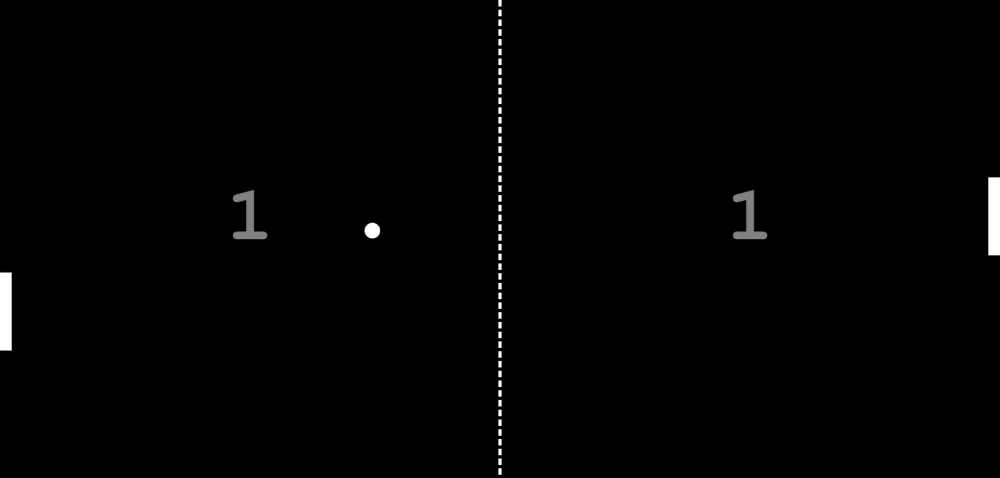

## Pong Game

### Screenshot

### 참조 API

### Points

기본적인 탁구 게임을 구현. HTML5의 `<canvas>` 요소를 사용하여 그래픽을 그리고, 마우스 움직임에 반응하여 사용자 패들을 제어.

1. **초기 설정**:
   - `<canvas>` 요소를 가져와서 크기를 화면 크기로 설정.
   - 패들, 공, 그리고 네트의 크기, 색상, 속도 등을 정의.
2. **도형 그리는 함수들**:
   - `drawRect`: 사각형(패들과 배경)을 그림.
   - `drawCircle`: 원(공)을 그림.
   - `drawText`: 점수 등의 텍스트를 그림.
   - `drawNet`: 중앙에 네트를 그림.
3. **객체 생성 함수들**:
   - `createPaddle`: 패들 객체를 생성.
   - `createBall`: 공 객체를 생성.
4. **게임 로직**:
   - `movePaddle`: 마우스 움직임에 따라 사용자 패들의 위치를 업데이트.
   - `collision`: 공과 패들 간의 충돌을 검사.
   - `resetBall`: 공이 경계를 벗어났을 때 위치를 초기화하고, 점수를 업데이트.
   - `update`: 게임의 상태를 업데이트. 공의 위치를 업데이트하고, 컴퓨터 패들의 움직임을 계산하며, 공과 패들 간의 충돌 처리를 .
   - `render`: 게임의 현재 상태를 화면에 그림. 배경, 네트, 패들, 공, 점수를 그림.
5. **게임 루프**:
   - `gameLoop`: `update`와 `render` 함수를 반복 호출하여 게임을 진행.
   - `setInterval`: 설정된 프레임 속도(`framePerSec`)에 따라 `gameLoop`를 주기적으로 호출.
6. 주요 기능
   - **패들 제어**: 사용자는 마우스를 움직여 패들을 제어할 수 있음.
   - **자동 상대**: 컴퓨터는 자동으로 상대 패들을 움직여 공을 받아침.
   - **점수 시스템**: 사용자 또는 컴퓨터가 공을 놓치면 상대방에게 점수가 주어짐.
   - **속도 증가**: 공이 패들에 맞을 때마다 속도가 조금씩 증가.
